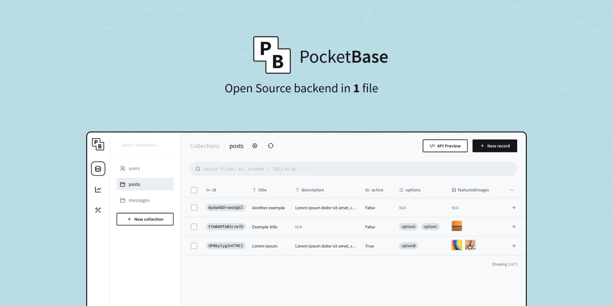
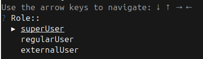
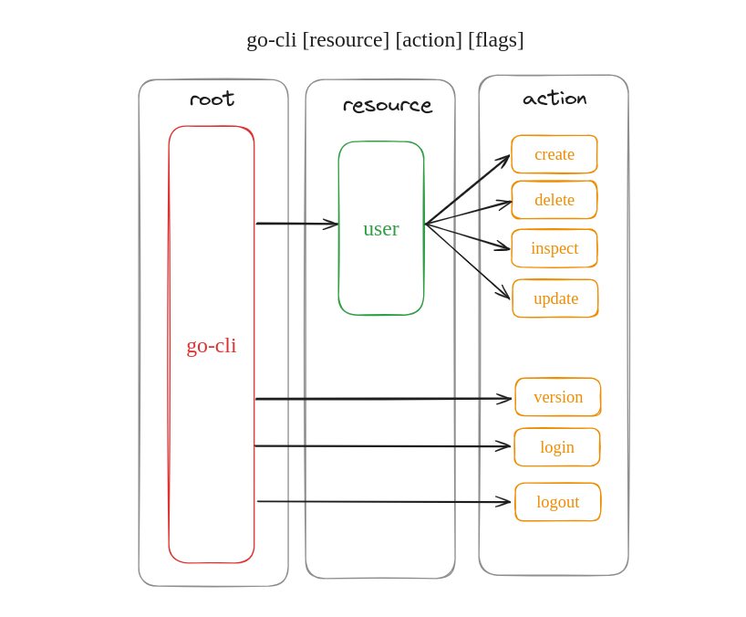

Ce projet a été réalisé dans le cadre de ma première année de Master à Sup De Vinci lors d'un module sur le langage Golang.

## Introduction

Le cahier des charges fourni par l'intervenant faisait la demande de réaliser une CLI en Golang pour une des solutions d'authentification imposées parmi les trois suivantes :

- [Casdoor](https://casdoor.org/)
- [PocketBase](https://pocketbase.io/)
- [Authentik](https://goauthentik.io/)

Une documentation devait être fournie afin d'avoir un projet clé en main utilisable par n'importe qui.

## Choix des solutions

### Backend

Après avoir comparé les 3 solutions d'authentification, j'ai remarqué qu'Authentik et Casdoor sont très complets, de ce fait, il faut un certain temps pour les prendre en main. Mais au vu de la deadline du projet ainsi que ses besoins, je suis parti sur l'outil **PocketBase**. C'est un outil simple à déployer et à utiliser, il remplit pile les besoins requis pour le projet.



### Framework Golang

Pour le framework Go, j'ai vu qu'il existait 2 framework qui font l'unanimité dans ce domaine : [**Cobra** 🐍](https://github.com/spf13/cobra) et [**Kong** 🦍](https://github.com/alecthomas/kong).

En suivant des tutoriels sur YouTube qui utilisait le framework **Cobra**, la simplicité d'utilisation m'a permis de rapidement mettre en place un POC de ma CLI avec une gestion des flags très intuitive et une documentation automatisée. J'ai donc continué sur ce framework. Il y a énormément de projet qui utilise Cobra comme on peut le voir dans cette [liste](https://github.com/spf13/cobra/blob/main/site/content/projects_using_cobra.md).

J'ai aussi ajouté le package [**Viper**](https://github.com/spf13/viper) dans le projet qui va permettre la gestion de la configuration dans le projet Golang dans le but de manipuler le fichier conf.json.

Et pour finir, l'ajout du package [**promptUI**](https://github.com/manifoldco/promptui) va permettre d'améliorer l'UX grâce notamment aux prompts interactifs.



## Architecture

### CLI

Au niveau de l'architecture de la CLI, j'ai choisi de me baser sur celle de **Docker** que je trouve personnellement très intuitive et pratique à utiliser, et qui est également réaliser via **Cobra**. Je suis donc parti sur le même modèle `command [ressource] [action] [flags]`.



La CLI va donc pouvoir permettre de se connecter et déconnecter de PocketBase et aussi de réaliser les actions de **CRUD** (Create, Read, Update, Delete) sur les utilisateurs présents dans le backend. Ce qui répond donc à la demande exprimée dans le cahier des charges.

Une fois l'architecture de ma CLI schématisé, ceci marque la fin de la phase de conception et je peux donc me lancé dans la phase de programmation de cette CLI afin de passer dans le concret.

### Code

```bash
├── cmd
│ ├── auth
│ │ ├── login.go
│ │ └── logout.go
│ ├── root.go
│ ├── user
│ │ ├── create.go
│ │ ├── delete.go
│ │ ├── inspect.go
│ │ ├── update.go
│ │ └── user.go
│ └── version
│ └── version.go
├── common
│ └── common.go
├── go.mod
├── go.sum
├── go-cli
└── main.go
```

- **main.go** : Permet d’initialiser le programme grâce à la fonction `main()`, qui va être le point d'entrée de notre programme.

- **cmd/** : Ce dossier regroupe l’ensemble des commandes disponibles dans la CLI. Les fichiers sont organisés en fonction de l'architecture de la CLI.

- **common/** : Module qui regroupe les fonctions qui sont utilisées dans plusieurs modules du projet.

## Déploiement

Pour le déploiement du projet, celui-ci se résume à un simple fichier `docker-compose.yaml` afin de créer le conteneur **PocketBase** qui contient la base de donnée **SQLite**. On monte également le fichier pb_data afin d'avoir une base de données déjà fourni au niveau des utilisateurs.

```yaml
services:
  pocketbase:
    image: registry.gitlab.com/toxma/go-cli/pocketbase:v1.0
    container_name: pocketbase
    ports:
      - 8090:8080
    volumes:
      - ./pb_data:/pb/pb_data
```

La **CLI** fonctionne quant à elle via un binaire récupérable depuis les **releases** GitLab ou bien en compilant le code directement en local.

## Conclusion

Ce projet a été assez challengeant, car il est intervenu après le module de cours d'une semaine sur le Golang. Il fallait donc encore approfondir ce langage pour bien appréhender ce projet. Ayant fait du C dans un passé pas si lointain que ça ce projet m'a rappelé quelques bons souvenirs. 😄

J'ai également pris de l'expérience sur le fait de choisir les bons outils pour répondre aux attentes du projet, mais également pour gagner du temps sur le développement.

Pour un peu plus de détails sur ce projet, le repo est disponible juste [ici](https://gitlab.com/Toxma/go-cli) !
