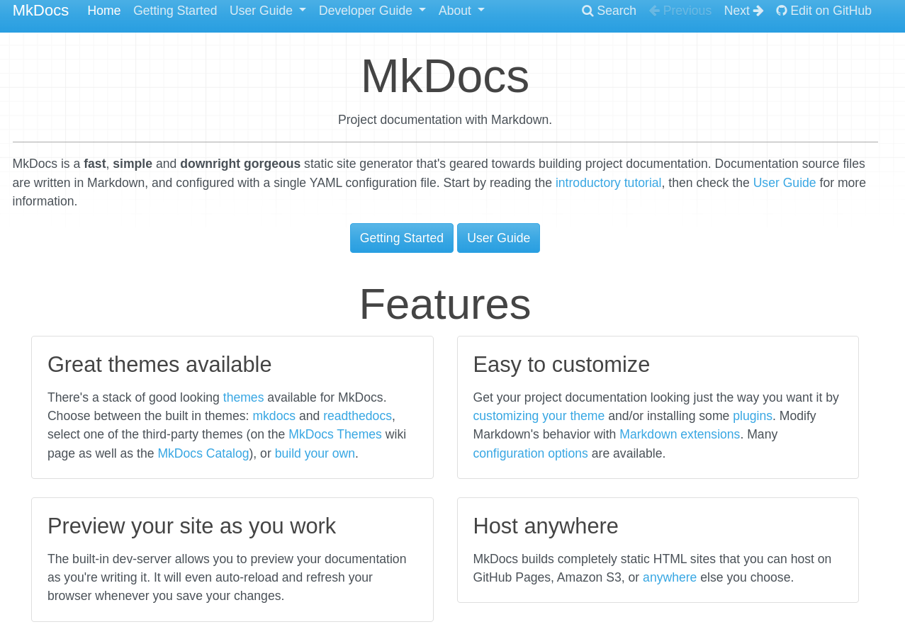
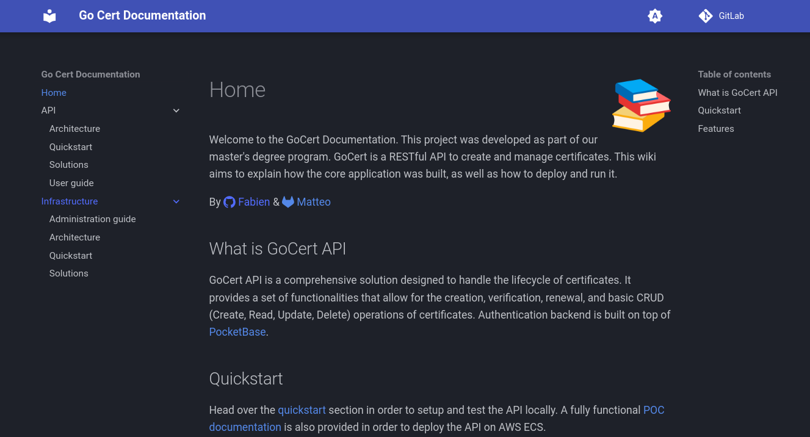

## Introduction

Avec le nombre d'informations qui arrivent vers moi chaque jour dans de nombreux domaines, des centaines de pages de notes manuscrites éparpillées un peu partout et jamais réutilisées, et toujours le souci de régler un problème pour la 20e fois sans se souvenir de la solution comme les 19 fois précédentes. 😆

Il me manquait donc un outil pour me servir de **second cerveau** 🧠 afin d'avoir toutes ces pages de notes ou ces erreurs déjà résolues **rassemblées** au même endroit.

L'expression du **besoin** était donc présente, avec des conditions obligatoires qui se sont dessinées au fil des différents tests :

- Rapidité d'accessibilité
- Rédaction des pages en Markdown
- Outil léger
- Hébergement local

## Qu'est ce que MkDocs ?

> MkDocs est un générateur de site statique rapide et simple, destiné à la création de documentation. Les fichiers de la documentation sont écrits en Markdown et configurés à l'aide d'un seul fichier de configuration YAML.

Cette définition présente sur le site de [MkDocs](https://www.mkdocs.org/) m'a directement inspiré une fois que je suis tombé dessus, car ceci répondait à mes 4 besoins exprimés ci-dessus, et j'ai donc décidé de me lancer dans le test
de cet outil.



La première version de mon **wiki** utilisait cet outil. J'ai utilisé un **Dockerfile** afin de pouvoir conteneuriser l'outil et de pouvoir l'utiliser en local sans besoin d'installer le paquet python **mkdocs**.

Seul bémol de cet outil est qu'il pique un peu les yeux. C'est ceci qui m'a motivé à trouver un thème !

### Material

Material est un framework qui s'utilise par-dessus **MkDocs** et va ainsi permettre de générer un site statique personnalisable via une multitude d'options, mais également la possibilité d'ajouter des plugins.

Ceci va permettre d'avoir un rendu très propre tout en minimisant la partie configuration, car bon nombre de fonctionnalités qui sont déjà intégrées dans le framework et une simple ligne dans le fichier de configuration permet de les ajouter.



## Mise en place du wiki

Pour mettre en place cet outil, la [documentation](https://squidfunk.github.io/mkdocs-material/creating-your-site/) de **Material** explique le déploiement via l'utilitaire **mkdocs** ou via conteneur **docker**. Pour ma part, je suis parti sur l'option **docker** afin de pouvoir utiliser ce conteneur dans mes différents environnements sans besoin d'avoir l'utilitaire présent sur toutes mes machines.

Pour commencer, il faut commencer par initialiser le projet dans le but de créer le squelette de notre wiki. Pour ceci, on passe la commande `new .` au conteneur **docker** possédant déjà l'utilitaire **mkdocs** en entrypoint.

```bash
docker run --rm -it -v ${PWD}:/docs squidfunk/mkdocs-material new .
```

Une fois le projet initialisé, on se retrouve avec l'arborescence suivante :

```bash
.
├─ docs/
│  └─ index.md
└─ mkdocs.yml
```

- **docs** : Représente l'arborescence de notre wiki
- **mkdocs.yaml** : Fichier de configuration du wiki

### Configuration

Pour la configuration du wiki, celle-ci s'effectue via le fichier `mkdocs.yaml` à la racine du projet. On va pouvoir y configurer le thème ainsi que les features que l'on souhaite qui sont disponibles [ici](https://squidfunk.github.io/mkdocs-material/setup/). Mais également les extensions pythons que l'on souhaite utiliser.

```yaml
# Configuration du site
site_name: My site
site_url: https://mydomain.org/mysite

# Configuration du thème material
theme:
  name: material
  icon:
    repo: fontawesome/brands/gitlab
  logo: assets/logo.png
  # Ajout de features
  features:
    - content.code.copy
    - navigation.instant
    - navigation.tabs
    - navigation.tabs.sticky
    - navigation.sections
    - navigation.path
    - navigation.top
  # Automatic light & dark mode
  palette:
    # Palette toggle for automatic mode
    - media: "(prefers-color-scheme)"
      toggle:
        icon: material/brightness-auto
        name: Switch to light mode

    # Palette toggle for light mode
    - media: "(prefers-color-scheme: light)"
      scheme: default
      toggle:
        icon: material/brightness-7
        name: Switch to dark mode

    # Palette toggle for dark mode
    - media: "(prefers-color-scheme: dark)"
      scheme: slate
      toggle:
        icon: material/brightness-4
        name: Switch to system preference
# Déclaration des plugins du thème material
plugins:
  - search

# Extension python pour le markdown
markdown_extensions:
  - pymdownx.superfences:
      custom_fences:
        - name: mermaid
          class: mermaid
          format: !!python/name:pymdownx.superfences.fence_code_format
  - admonition
  - pymdownx.details
  - pymdownx.superfences
  - attr_list
  - pymdownx.emoji:
      emoji_index: !!python/name:material.extensions.emoji.twemoji
      emoji_generator: !!python/name:material.extensions.emoji.to_svg
```

Dans mon cas, j'ai ajouté différentes features permettant par exemple de copier les blocs de code, d'avoir des onglets par nom de sections ou bien le choix entre light & dark mode. J'ai également ajouté le plugin `search` afin d'avoir une barre de recherche dans mon wiki.

J'ai également ajouté des extensions pythons permettant de mettre des emojis, des schémas mermaid ou bien d'ajouter des classes HTML/CSS à mes blocs de markdown.

## Déploiement

Pour la partie déploiement, je lance ce projet uniquement en local via un conteneur docker, car je n'ai pas l'intérêt de l'héberger sur le web actuellement.

Je passe par un fichier `docker-compose.yml` dans lequel je peux lancer tous mes outils en local dont celui-ci.

```bash
services:
  mkdocs-material:
    restart: "always"
    ports:
      - "8000:8000"
    container_name: "wiki"
    volumes:
      - "/path/to/wiki:/docs"
    image: "squidfunk/mkdocs-material"
```

## Conclusion

Je pense que l'ajout de ce wiki dans ma boîte à outils va me servir de plus en plus avec le temps. Toutes les connaissances acquises vont être regroupées au même endroit et triées par domaine. Ceci va me permettre une facilité et rapidité d'accès à l'information, augmentant donc ma productivité et amenant par la même occasion une réduction de ma perte de temps.
